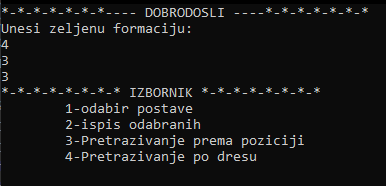
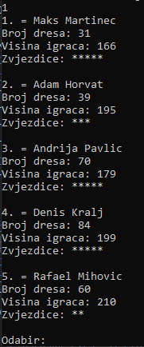

# FUT-Draft
C++ version of Fifa FUT draft - gamemode where players build team from scratch by using a selection of random player picks

C++ console app inspired by Fifa Ultimate Team FUT Draft. In this gamemode, user choses team formation, and if it is valid, he chooses 11 player for his team, based on chosen formation.

After choosing first eleven, user can search players by shirt number or by player's position. He can also see all players he had chosen.

This mini project was made using linked lists with lots of number randomization as final first year university project for course Programming 2.
